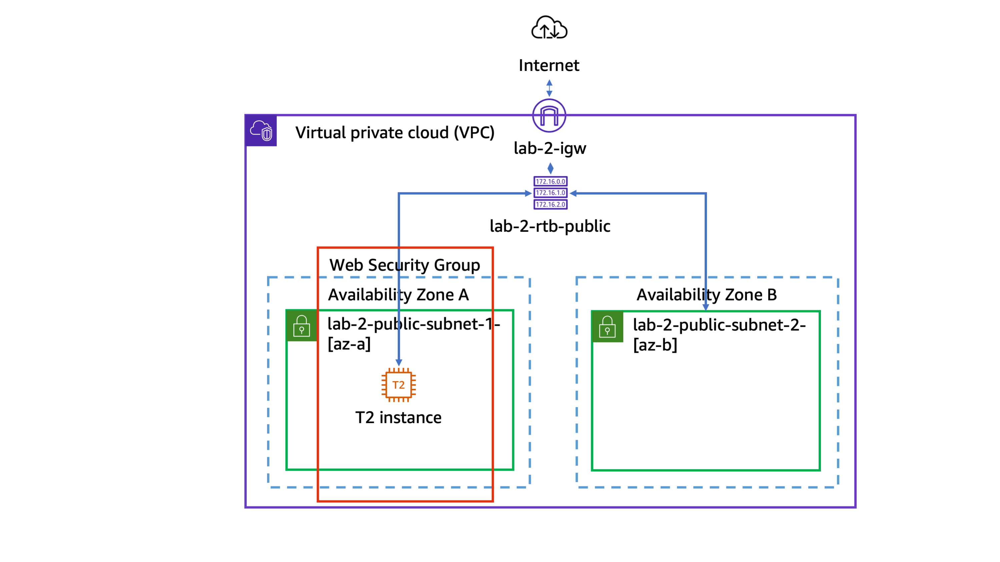

# Aws Lab

```
This terraform deploy is inspired by an official aws skills lab.
In that lab, you use the aws management console to create a web server.
I recreated the same scenario using Terraform  
```

## FINAL RESULT INFRAESTRUCTURE
